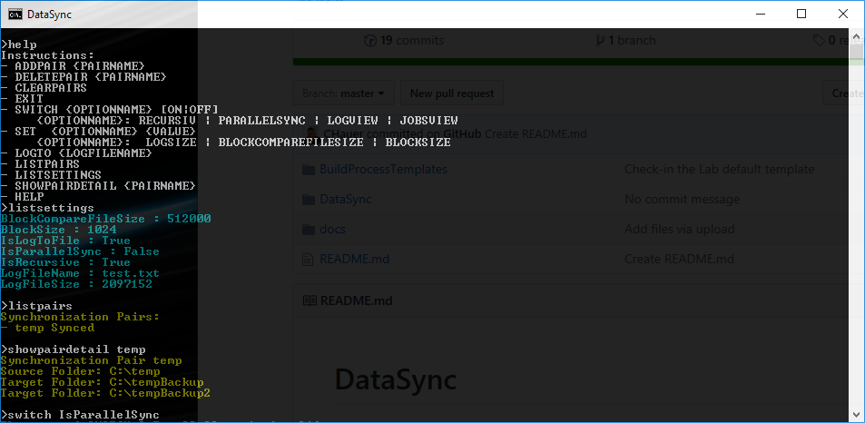

# DataSync
Simple tool to synchronize from one source to multiple target directories.

## UI Example

---
FH Projekt
Vorlesung Programmieren

Einfaches tool das die Synchronisation von einem Quell zu mehreren Ziel Verzeichnisen durchführen soll.
